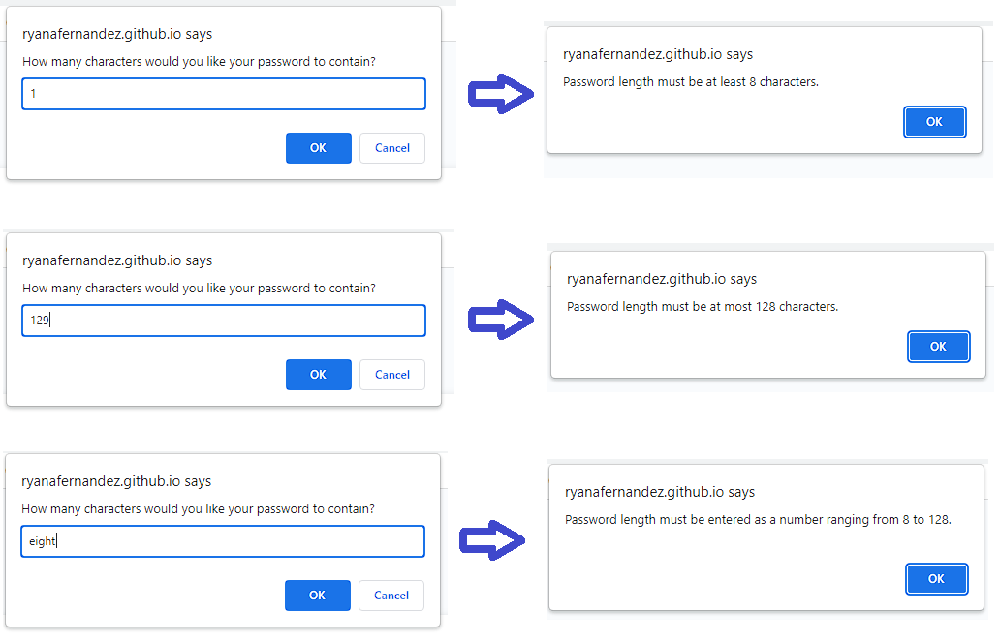

# Password Generator

## Description

My motivation for this project was to build a password generator and familiarize myself with basic JavaScript concepts. By building this project, I was able to explore concepts including: variables, functions, conditional statements, arrays, along with Objects and Methods for obtaining input from a user. This project solves the problem of obtaining a dynamic and user-defined set of criteria, and applying the selected criteria to produce a randomly generator password for the user. By completing this project, I learned how to use the prompt(), confirm(), and alert() methods of the Window object to direct a user to select options from a given list. 

The deployed application can be found using the following link: https://ryanafernandez.github.io/Password-Generator/

## Installation

N/A

## Usage

To use this website, there is a button labeled "Generate Password" that will initiate the script for generating and displaying the user's password.

After clicking the button, the user is presented with a prompt for entering the number of characters they would like their password to contain. The user's input must be between 8 and 128 entered as a number. If the user enters an out of bounds number or the user's input is not entered as a number, then an alert will be displayed that will instruct the user to correct any errors in their entry.

Once the password length has been correctly entered, then the user will be presented with a series of four confirmation windows that guide the user to select which criteria they would like to be applied to their generated password.

If the user selects none of the presented options, then an alert will be displayed instructing the user to select at least one option.

Once the user correctly selects the password criteria options, then the user will be presented with their randomly generated password. The screenshots below show examples for generated passwords with different criteria being applied.

50 Characters with all Criteria Selected

50 Characters with only Alphabetic Characters

50 Characters with Lowercase, Uppercase, and Numberic Characters

## Credits

N/A

## License

N/A
